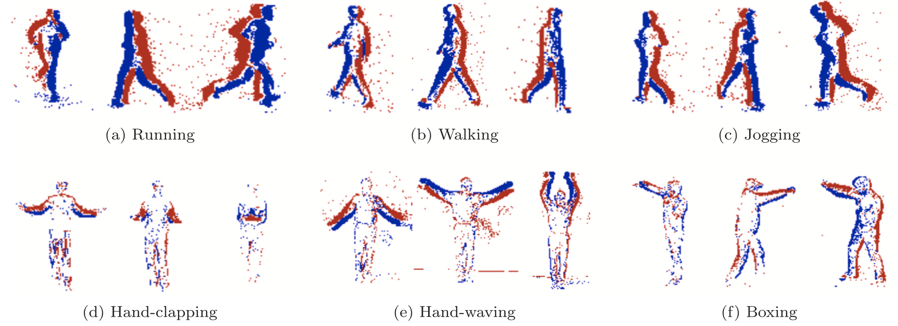

# Overview
This repo provides the code of [Neuromorphic Imaging and Classification with Graph Learning](https://doi.org/10.1016/j.neucom.2023.127010).
```
@article{zhang2024neuromorphic,
  title    =  {Neuromorphic Imaging and Classification with Graph Learning},
  author   =  {Pei Zhang and Chutian Wang and Edmund Y. Lam},
  journal  =  {Neurocomputing},
  volume   =  {565},
  pages    =  {127010(1--9)},
  month    =  {January},
  year     =  {2024},
  doi      =  {10.1016/j.neucom.2023.127010},
}
```
## Dataset
1. N-CARS:      https://www.prophesee.ai/2018/03/13/dataset-n-cars/
2. N-MNIST:     https://www.garrickorchard.com/datasets/n-mnist
3. ASL-DVS:     https://github.com/PIX2NVS/NVS2Graph
4. KTH Dataset: https://www.csc.kth.se/cvap/actions/

Download our [SN-KTH](https://connecthkuhk-my.sharepoint.com/:u:/g/personal/u3008016_connect_hku_hk/EQ1s3MCBCFhMiE7Vvi7786kBdZ1RBr-kceZL3zQPUktxsA) (password: <ins>zhang2024neuromorphic</ins>):



To simulate your own SN-KTH, please refer to [v2e](https://github.com/SensorsINI/v2e) or [PIX2NVS](https://github.com/PIX2NVS/PIX2NVS).


